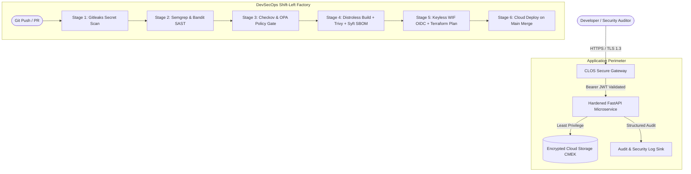

# System Architecture — CISO Learning Operating System (CLOS)

> Canonical Technical Architecture Document for the CLOS Platform & Secure Software Factory.

---

## 1. Architectural Principles

1. **Security by Design**: Security controls are specification-driven and non-bypassable.
2. **Defense in Depth**: Inbound, runtime, IaC, and supply chain controls operate independently.
3. **Least Privilege**: Keyless, short-lived OIDC identities and unprivileged non-root containers.
4. **Evidence Chain**: Every control links to automated tests and machine-readable evidence.
5. **Fail-Closed Default**: Security gates halt execution upon scanner failure or policy violation.

---

## 2. High-Level System Architecture (C4 Container View)



---

## 3. Trust Boundaries & Security Enclaves

```
[Untrusted Zone: Internet / Public Requests]
                     │
                     │  HTTPS (TLS 1.3) + Bearer JWT
                     ▼
┌─────────────────────────────────────────────────────────────┐
│ TRUST BOUNDARY 1: Edge & Ingress Validation                 │
│ • Strict CORS Whitelist (https://mycompany.com)             │
│ • OWASP Security Headers (CSP, HSTS, X-Content-Type-Options)│
│ • RFC 7519 HMAC-SHA256 Token Verification                   │
└─────────────────────────────────────────────────────────────┘
                     │ (Authenticated Subject)
                     ▼
┌─────────────────────────────────────────────────────────────┐
│ TRUST BOUNDARY 2: Runtime Container Sandbox                 │
│ • Distroless Non-Root Base (UID 65532)                      │
│ • Zero Shell, Read-Only Filesystem                          │
│ • Ephemeral Process Memory                                  │
└─────────────────────────────────────────────────────────────┘
                     │ (Keyless Short-Lived OIDC)
                     ▼
┌─────────────────────────────────────────────────────────────┐
│ TRUST BOUNDARY 3: Cloud Infrastructure (GCP)                │
│ • Google Cloud Storage (Uniform Bucket-Level Access)        │
│ • Cloud KMS Customer-Managed Encryption Keys (90-Day Rotate)│
│ • Public Access Prevention Enforced via OPA Rego            │
└─────────────────────────────────────────────────────────────┘
```

---

## 4. Key Architectural Decisions (ADR Matrix)

| ADR ID | Decision Title | Chosen Solution | Rationale & Trade-Offs |
| :---: | :--- | :--- | :--- |
| **ADR-01** | **Identity & Access Management** | GCP Workload Identity Federation (WIF) | Eliminates long-lived JSON service account keys; exchanges short-lived OIDC tokens. |
| **ADR-02** | **Container Hardening** | Multi-stage Google Distroless | Strips package managers, shells (`/bin/sh`), and curl to prevent post-exploitation lateral movement. |
| **ADR-03** | **Policy-as-Code Engine** | Open Policy Agent (OPA) / Conftest | Enforces declarative security invariants against Terraform plans before cloud provisioning. |
| **ADR-04** | **Data Protection at Rest** | Cloud KMS CMEK (AES-256) | Guarantees organizational control over encryption keys with automated 90-day key rotation. |
| **ADR-05** | **Supply Chain Integrity** | Sigstore Cosign + Syft SPDX SBOM | Provides cryptographic provenance and verifiable attestation for all container artifacts. |

---

## 5. References & Related Documents

* **Threat Modeling**: [STRIDE Threat Model](file:///Users/mananvora/CLOS_Kickoff_Mission/07_PRIMARY_PROJECT/THREAT_MODEL.md)
* **AI Threat Modeling**: [AI Security Threat Model](file:///Users/mananvora/CLOS_Kickoff_Mission/07_PRIMARY_PROJECT/ai_security_gateway/docs/AI_THREAT_MODEL.md)
* **API Specification**: [OpenAPI 3.1 Contract](file:///Users/mananvora/CLOS_Kickoff_Mission/07_PRIMARY_PROJECT/docs/openapi.yaml)
* **Control Evidence**: [Control & Evidence Matrix](file:///Users/mananvora/CLOS_Kickoff_Mission/07_PRIMARY_PROJECT/CONTROL_EVIDENCE_MATRIX.md)
