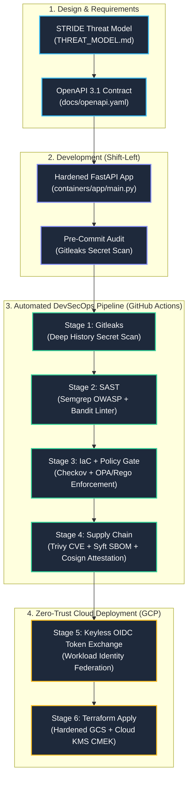

# CLOS — Cybersecurity Learning & DevSecOps Operating System

<div align="center">

[](https://github.com/vmanan22/ciso-mastery-framework/actions/workflows/devsecops.yml)
[](https://csrc.nist.gov/publications/detail/sp/800-218/final)
[](07_PRIMARY_PROJECT/docs/openapi.yaml)
[](07_PRIMARY_PROJECT/policies/iac_policies/)
[](07_PRIMARY_PROJECT/iac/environments/gcp-dev/)
[](LICENSE)

**An enterprise-grade, spec-driven DevSecOps reference architecture and Technical CISO operational playbook.**

[Architecture](#-system-architecture) • [SSDLC Pipeline](#-6-stage-devsecops-pipeline) • [Threat Model](#-threat-model--policy-traceability) • [Cloud Infrastructure](#-cloud-infrastructure--zero-trust-iam) • [Repository Map](#-repository-map)

</div>

---

## 🎯 Executive Overview

**CLOS (Cybersecurity Learning Operating System)** is a dual-purpose repository designed for **Technical CISOs, Security Architects, and DevSecOps Engineers**:

1. **Production-Ready SSDLC Reference Architecture**: End-to-end implementation of a hardened, spec-driven API secured across all lifecycle phases: **Threat Modeling ➔ Spec Contract ➔ Pre-commit ➔ SAST/SCA ➔ Policy-as-Code (OPA) ➔ Keyless OIDC Cloud Deployment**.
2. **Executive Cybersecurity Playbook**: Translates board-level risk frameworks (NIST SP 800-218, OWASP SAMM, OSCAL) into deterministic automated pipeline gates.

---

## 🏗️ System Architecture



---

## 🔒 6-Stage DevSecOps Pipeline

The GitHub Actions workflow [`.github/workflows/devsecops.yml`](.github/workflows/devsecops.yml) enforces **strict, sequential quality gates**. Any finding blocks downstream stages:

| Stage | Name | Toolchain | Security Objective |
| :---: | :--- | :--- | :--- |
| **1** | **Secret Scan** | `gitleaks` | Scans entire repository commit history for credentials and API keys. |
| **2** | **SAST Code Analysis** | `semgrep` + `bandit` | AST pattern matching for OWASP Top 10 + Python injection/crypto vulnerabilities. |
| **3** | **IaC & Policy Gate** | `checkov` + `OPA/conftest` | Evaluates Terraform plan JSON against custom Rego policies (blocks unencrypted/public resources). |
| **4** | **Supply Chain Security** | `trivy` + `syft` + `cosign` | Scans container CVEs, exports SPDX-JSON SBOM, and signs artifacts keylessly via Sigstore. |
| **5** | **Cloud Dry Run** | `GCP WIF` + `terraform plan` | Authenticates keylessly via GitHub OIDC; posts plan diff to pull requests. |
| **6** | **Cloud Deployment** | `terraform apply` | Provisions CMEK-encrypted GCP infrastructure only on approved `main` branch merges. |

---

## 🛡️ Threat Model & Policy Traceability

Every infrastructure policy and pipeline gate maps directly to a verified threat in the [STRIDE Threat Matrix](07_PRIMARY_PROJECT/THREAT_MODEL.md):

| Threat ID | Threat Vector | STRIDE | Automated Defense / Policy | Implementation |
| :--- | :--- | :---: | :--- | :--- |
| **I3** | Public Artifact Storage Exposure | **I** | `gcp_storage_security.rego` | Enforces `public_access_prevention = "enforced"` + Uniform IAM |
| **I4** | Static Service Account Key Leak | **I** | `gcp_iam_security.rego` | Blocks `google_service_account_key` resources; mandates WIF OIDC |
| **T3** | Dependency Supply Chain Hijack | **T** | `devsecops.yml` (Stage 4) | Generates SPDX SBOM via Syft + Cryptographic Cosign signing |
| **T5** | Malicious Artifact Overwrite | **T** | `main.tf` | Enables Object Versioning + 30-Day automated lifecycle rules |
| **E3** | Cloud Privilege Escalation | **E** | `gcp_iam_security.rego` | Denies `roles/owner` and `roles/editor` primitive project bindings |

---

## ☁️ Cloud Infrastructure & Zero-Trust IAM

The GCP IaC in [`07_PRIMARY_PROJECT/iac/environments/gcp-dev/`](07_PRIMARY_PROJECT/iac/environments/gcp-dev/) provisions a defense-in-depth storage baseline for **~$0.06/month**:

```
GCP Project (ssdlc-platform-dev)
├── Cloud KMS Key Ring (ssdlc-dev-keyring)
│   └── CMEK Key (ssdlc-dev-storage-key) [AES-256, 90-Day Auto Rotation]
│           │
│           └── Encrypts Data-at-Rest
│                   ▼
└── Cloud Storage Bucket (ssdlc-artifacts-ssdlc-platform-dev-dev)
    ├── Public Access: ENFORCED (All public ACLs disabled)
    ├── Uniform Bucket-Level Access: ENABLED (IAM only)
    ├── Versioning: ENABLED (Tamper-evident audit trail)
    └── IAM Access: Least-Privilege (roles/storage.objectCreator only)
```

---

## 🗂 Repository Map

```
.
├── .github/workflows/          # 6-Stage DevSecOps Pipeline definition
├── 00_ONBOARDING/              # 30-Day Technical CISO Learning Plan & Profile
├── 01_TECHNICAL_SKILLS/        # Hands-on labs (IaC, AppSec, K8s, Cloud Security)
├── 02_LEADERSHIP_SKILLS/       # Executive communication, board presentations, budgeting
├── 03_WEEKLY_CHALLENGES/       # Weekly security architectural scenarios & challenges
├── 04_HALL_OF_PAIN/           # Engineering retrospective, mistakes & lessons learned
├── 05_LEARNING_LOG/            # Daily session journal & concept definitions
├── 06_INTERVIEW_PREP/          # CISO / Director question banks and strategy guides
└── 07_PRIMARY_PROJECT/         # AI-Powered Secure SDLC Platform
    ├── containers/app/         # Hardened FastAPI microservice & Dockerfile.hardened
    ├── docs/                   # OpenAPI 3.1 Spec & NIST OSCAL Component Definitions
    ├── iac/environments/       # Multi-Cloud Terraform (GCP dev + AWS dev)
    ├── policies/               # Policy-as-Code (OPA/Rego, Kyverno, Falco runtime)
    ├── scripts/                # Local shift-left scanners (run_sast_local.sh)
    └── THREAT_MODEL.md         # Comprehensive STRIDE Threat Model (v2.0)
```

---

## 🚀 Quick Start (Local Development)

### 1. Run Shift-Left Security Scans Locally
Catch vulnerabilities before pushing code:
```bash
# Run local SAST suite (Semgrep + Bandit + Gitleaks)
./07_PRIMARY_PROJECT/scripts/run_sast_local.sh
```

### 2. Validate Policy-as-Code Locally
```bash
# Test IaC against OPA Rego security policies
conftest test 07_PRIMARY_PROJECT/iac/environments/gcp-dev/ \
  --policy 07_PRIMARY_PROJECT/policies/iac_policies/
```

### 3. Deploy Cloud Baseline
```bash
cd 07_PRIMARY_PROJECT/iac/environments/gcp-dev
terraform init
terraform apply -var="project_id=ssdlc-platform-dev" -var="pipeline_service_account=ssdlc-pipeline@ssdlc-platform-dev.iam.gserviceaccount.com"
```

---

## 📜 Principles & Standards

* **Spec-Driven Architecture**: Contracts (`openapi.yaml`, `THREAT_MODEL.md`) govern code, not the reverse.
* **Changes Must Teach**: Every architectural decision and code change is documented with *Why*, *What*, and *How*.
* **Zero Static Secrets**: All CI/CD authentications utilize ephemeral OIDC tokens via Cloud Workload Identity Federation.
* **Cost Consciousness**: Built within Cloud Always-Free Tier limits.

---

<div align="center">
<b>Maintained by Manan Vora</b> • Technical CISO & Security Architecture Portfolio
</div>
